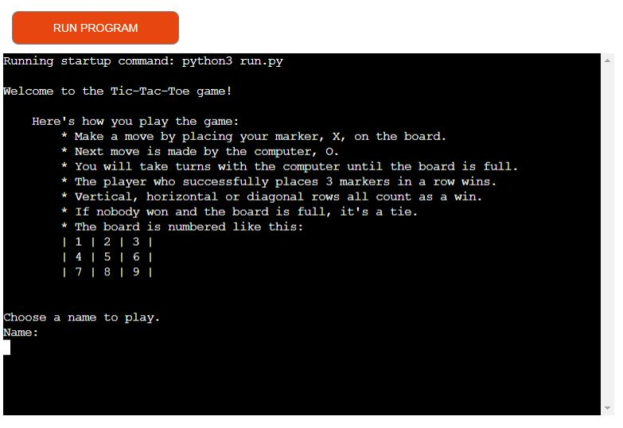

<h1>TIC-TAC-TOE</h1>

</li>

<h2>The Tic-Tac-Toe game</h2>

I built this game as my 3rd milestoneproject, learning Python.  
The game is meant to be easy but fun classic tic-tac-toe.
 
<h3>Flowchart to visualise the steps of the game:</h3>

 
<h3>Primary goal of the game:</h3> 
<ul>
<li>Get three in row to win</li>
<li>Horizontal, vertical or diagonal will work</li>
<li>Player 1 (human) and player 2 (computer) takes turns to place their marker on the board</li>
<li>Players will be represented by X and O on the board</li>
<li>When the board is full and there is no winner, it´s a tie</li>
</ul>

 

Link to the live app here:

<a href="https://tic-tac-toe-game-pp3.herokuapp.com/">Tic-Tac-Toe-Game-PP3 on Heroku</a>
 

 
 

Link to the code in GitHub:

<a href="https://github.com/helenahagman/tic-tac-toe">Tic-Tac-Toe on GitHub</a>
 
 
<h2>CONTENTS</h2>

<li>

<h2>Deployment</h2>

Deployment was done following the steps in the walk through project, Love Sandwiches:
<li>Checking the code for input variables and add \n to those lines</li>
<li>pip3 freeze > requirements.txt</li>
<li>Add and push code to github</li>
<li>Build new app in Heroku</li>
<li>Build packs: heroku/python and heroku/nodejs</li>
<li>Connect to Github repository code</li>
<li>Enabled automatic deploys for the app</li>
<li>*Successfully built in Heroku*</li>

 

<h2>Testing</h2>

<li><a href="https://www.pythonchecker.com/">Python Syntax Checker PEP8</a> 

Used for testing the code for syntax errors
</li> 
<li><a href="https://lighthouse-metrics.com/lighthouse/checks/276b5f51-03df-4623-94e4-edb401d97a5e/runs/6992b638-3ac8-4fd5-915d-b2eb7bb9a395">Lighthouse test</a> </li> 
<li><a href="https://pep8ci.herokuapp.com/">Code Institute CI Python linter</a> 

Used for testing the code for errors- corrected and tested again - all clear with no errors found
  </li>
 
<li><a href="https://extendsclass.com/python-tester.html">Python Code Checker</a> 

Used for testing the code for syntax errors - 1 Syntax error detected

</a></li>
 

<h3>Final testing of the code in the live app</h3>

<table style="width:100%">
  <tr>
    <th>Feature</th>
    <th>Expected Outcome</th>
    <th>Test Performed</th>
    <th>Result</th>
    <th>Pass/Fail</th>
  </tr>
<tr>
    <td>Push Run program button</td>
    <td>Welcome message should appear along with rules of the game and a message that askes the player to enter a name</td>
    <td>Press "RUN PROGRAM" button</td>    
    <td>Welcome message, game rules and the question for the user to enter a name was displayed</td>
    <td>Pass</td>
</tr>
<tr>    
    <td>Enter correct name in alphabetic letters</td>
    <td>Name should appear along with a message to start the game</td>
    <td>Entered "Miles"</td>
    <td>Name was printed as expected along with a blank game board</td>
    <td>Pass</td>
</tr>
<tr>
<tr>
    <td>Enter numbers instead of letters</td>
    <td>Error message should appear and ask the user to use alphabetic letters</td>
    <td>Entered "5"</td>
    <td>Message that only alphabetic letters are accepted was presented to the user</td>
    <td>Pass</td>
</tr>
<tr>
    <td>Enter number to make a move</td>
    <td>Game should start and position should be marked with X on the board</td>
    <td>Entered "6"</td>
    <td>X was printed to the correct position on the board, computer move on the board and a message to enter a new number</td>
    <td>Pass</td>
</tr>
<tr>
    <td>Enter letter to make a move</td>
    <td>Error message should appear and ask the user to enter a number between 1 and 9</td>
    <td>Entered "g"</td>
    <td>Message shown: Try again, a number between 1 and 9: just as expected</td>
    <td>Pass</td>
</tr>
<tr>
    <td>Player wins the game</td>
    <td>A message with the players name should be presented along with the information that he/she won and the question to play again or not</td>
    <td>Won the game</td>
    <td>The message: The winner is Miles! Play again? Print Y for yes or N to quit. was presented as expected</td>
    <td>Pass</td>
</tr>
<tr>
    <td>Computer wins the game</td>
    <td>A message stating that the computer wins should appear and the question to play again.</td>
    <td>Played until the computer won</td>
    <td>Message: Tuff luck, computer wins! was presented along with the play again question as expected.</td>
    <td>Pass</td>
</tr>
<tr>
    <td>Full board - no winner</td>
    <td>A message that the game ends in a tie and nobody won along with a question to play again</td>
    <td>Played to a full board with no winner</td>
    <td>Message: Tie! Nobody wins. Play again? Print Y for yes or N to quit: was presented as expected</td>
    <td>Pass</td>
</tr>
<tr>
    <td>Y to restart the game</td>
    <td>The game restarts and wishes the user good luck along with an empty game board</td>
    <td>Printed "Y"</td>
    <td>Message: Miles, good luck! was printed as expected with the empty game board to start playing again.</td>
    <td>Pass</td>
</tr>
<tr>
    <td>N to not restart the game</td> 
    <td>Should be presented with a short message "Ok, see you later!" when choosing N and also a play again question</td>
    <td>Printed "N"</td>
    <td>Message: Ok, see you later! Play again? Print Y for yes and N to quit: was presented as expected.</td>
    <td>Pass</td>
</tr>
</table>
</li>
  
<h3>Bugs and errors</h3>
 

During the creating process of this game a lot of the work have been trying to fix minor bugs and errors to make the game work the way I intended it to.

A few fixes along the way:
<li>Display of the empty game board - tried several ways of displaying the board</li>
<li>Name of the player didn't display efter entering the name</li>
<li>No error message when player entered a number in the name feild - added isalpha in the player_name function</li>
<li>The board didn't update the player move on the board - was missing position input</li>
<li>The game didn'r restart when Y was entered - fixed in the start_game function</li>
<li>When a player chose to play again they were told to add a new name - fixed in the start_game funciton</li>
 

 <h3>Known unsolved bugs</h3>
 
<li><a href="https://extendsclass.com/python-tester.html">Python Code Checker</a> 

Used for testing the code for syntax errors - 1 Syntax error detected.

</a>

Status - Not solved
</li>
 

<h3>Credits & Inspiration</h3>

Sites and code used for inspiration and test on this project:

<li><a href="https://www.programiz.com/python-programming/online-compiler/">Online Python Compiler</a> 

Used throughout the project for testing the code as I went along to see the result straight away.
</li>
<li><a href="https://inventwithpython.com/invent4thed/chapter10.html">Invent With Python</a> 

Used for inspiration and tips on how to build the program
</li>
<li><a href="https://github.com/Kieran132/TicTacToe-project3/blob/main/run.py">Fellow student Kieran</a> 

For ideas on how to present the project
</li>
<li><a href="https://github.com/kera-cudmore/readme-examples">Kera Cudmore, readme examples</a> 

For inspiration on how to build the readme file and content to add.
</li>
<li><a href="https://github.com/kera-cudmore/TheQuizArms/blob/main/TESTING.md#Full-Testing">Kera Cudmore, readme examples</a> 

For inspiration on how to display the testing with tables
</li>
<li><a href="https://www.lucidchart.com/pages/what-is-a-flowchart-tutorial">Lucidchart</a></li>

To make the chart for the thinking-process of the project

<li><a href="https://www.w3schools.com/python/default.asp">W3School Pyhton Tutorial</a></li>

Problem solvning

<li><a href="https://www.python.org/about/help/">Pyhton.org</a></li>

Problem solvning

<li><a href="https://www.youtube.com/watch?v=eWRfhZUzrAc">Pyhton for beginners</a></li>

Problem solvning and idéas

 

A special thank you to my mentor Jubril Akolade for useful tips and support on the way
